# Getting started with Mobile Device Development with Office 365 #
In this lab, you will investigate the Android development with the Office 365 Calendar.

## Prerequisites ##
1. Android Studio 2.0
2. Android SDK 23 (Android 6.0)
3. Java JDK 1.7.0

## Create Android project ##
1. Open **Android Studio**.
2. Click **Start a new Android Studio project**.<br/>
	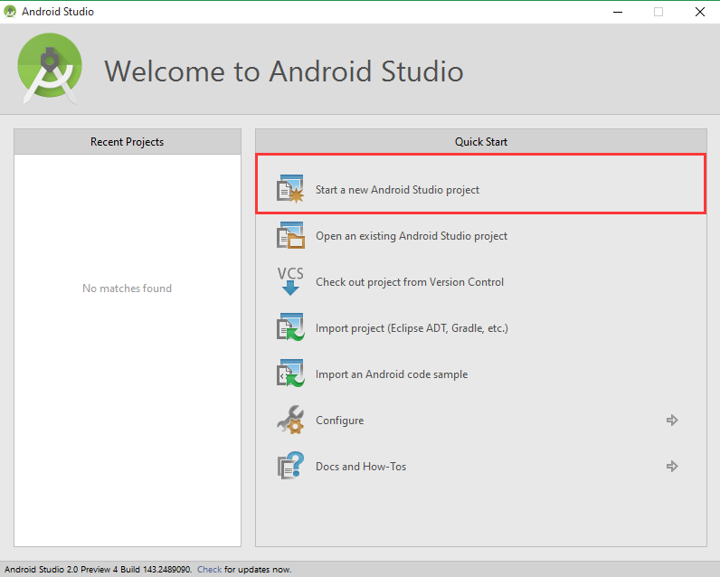
3. Type your **Application name** and **Company Domain** and specify the **Project location**, then click **Next**.<br/>
	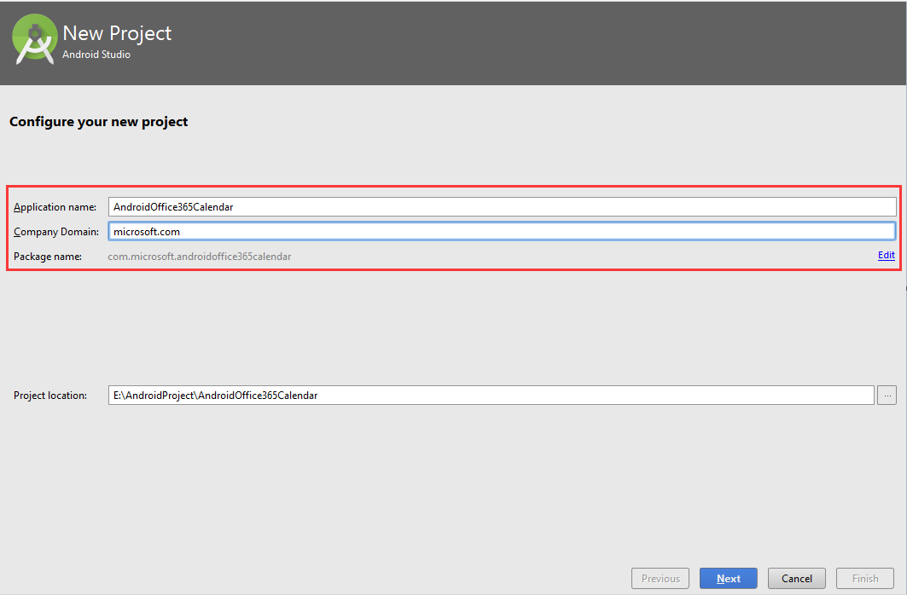
4. Select **Minimum SDK API 23** and leave the other settings as default, then click **Next**.<br/>
	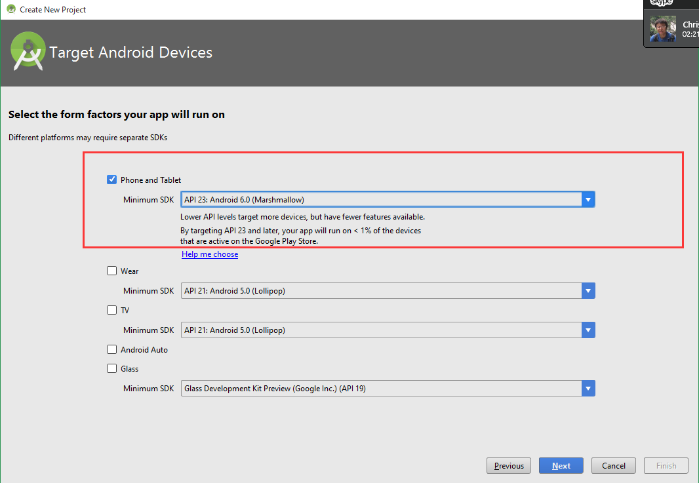
5. Select **Blank Activity**, then click **Next**.<br/>
	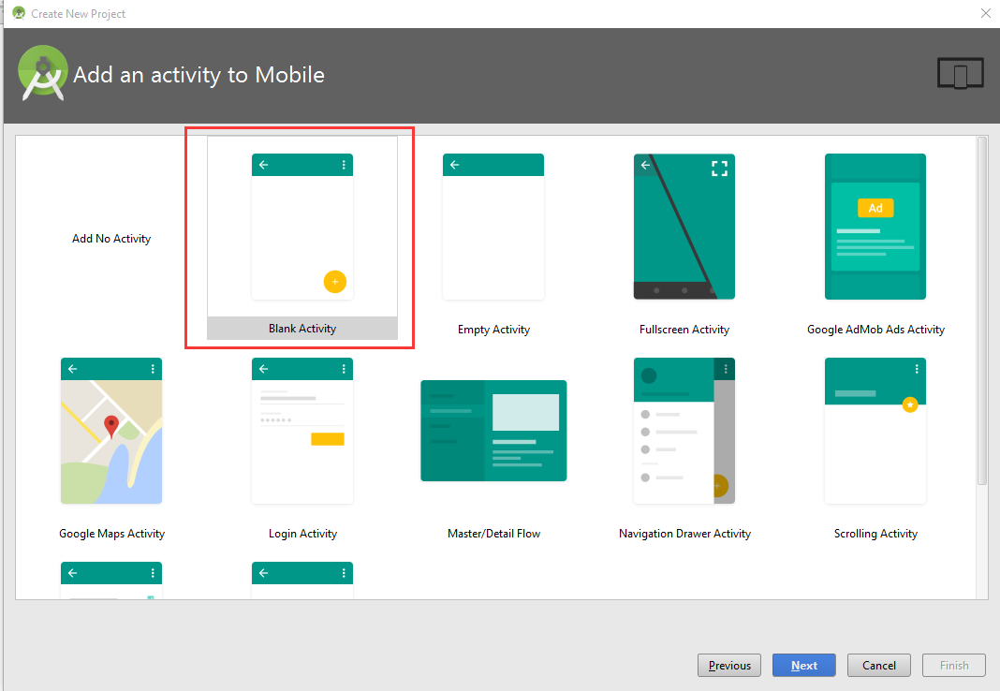
6. Make sure all settings the same as below, then click **Finish**.<br/>
	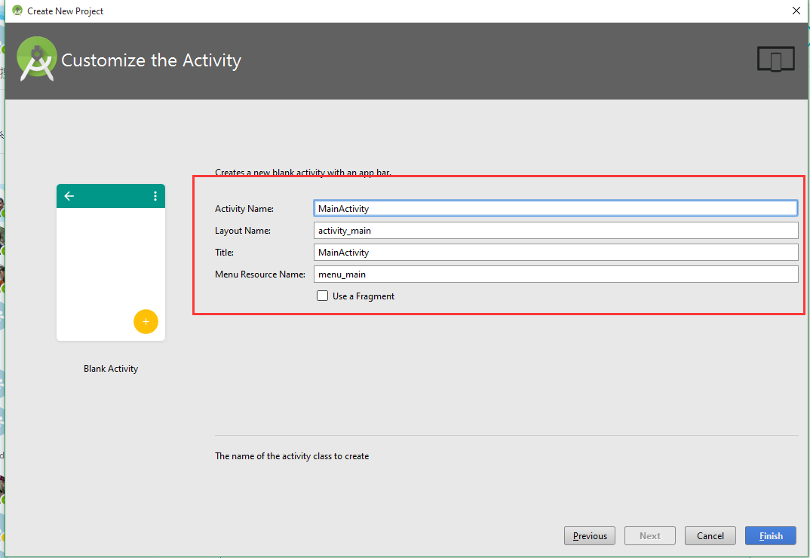
7. The **Android Studio** window will be displayed.<br/>
	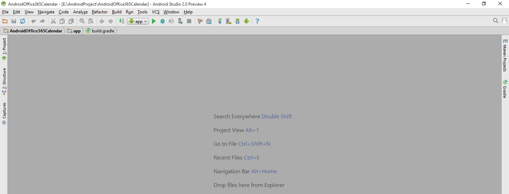
8. Open **Project** tab and click **build.gradle (Module: app)**<br/>
	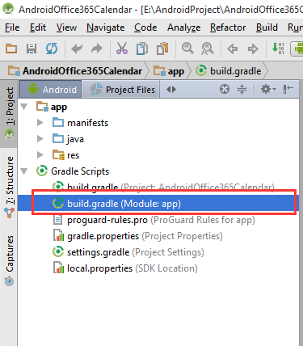
9. Add the below code in **dependencies** note.

	````java
	// base OData library:
	compile group: 'com.microsoft.services', name: 'odata-engine-core', version: '+'
	compile group: 'com.microsoft.services', name: 'odata-engine-android-impl', version: '+', ext:'aar'

	// Azure Active Directory Authentication Library
	compile group: 'com.microsoft.aad', name: 'adal', version: '1.1.3'

	// Graph Library
	compile group: 'com.microsoft.services', name: 'graph-services', version: '+'
	````

	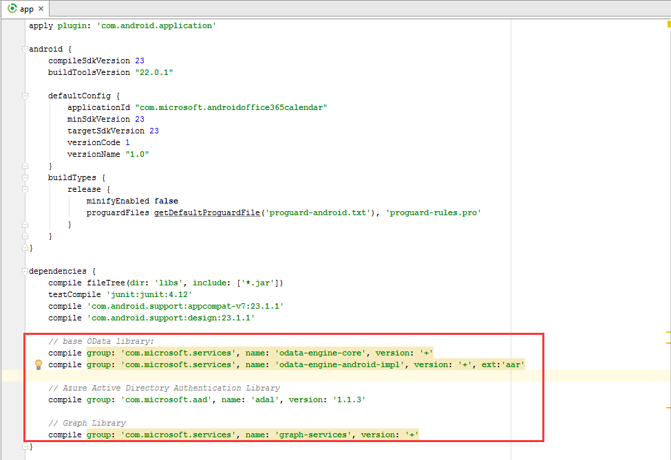
10. Save the file and click **Sync Project with Gradle Files** in the top tool bar.<br/>
	

## Integrate Office 365 services ##
1. Sign in to the [Azure Management Portal](https://manage.windowsazure.com/) with your Office 365 credentials.
2. Click **ACTIVE DIRECTORY** on the left menu, go to the **DIRECTORY** tab, and then click your directory.<br/>
	
3. Go to the **APPLICATIONS** tab on the new page.
4. Click **ADD** button on the bottom menu.<br/>
	
5. On the **What do you want to do** page, click **Add an application my organization is developing**.<br/>
	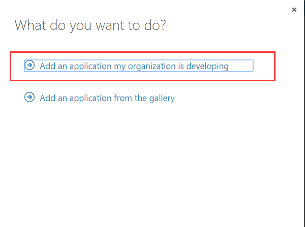
6. On the **Tell us about your application** page, specify your application **NAME** (AndroidOffice365Calendar) and select the option **NATIVE CLIENT APPLICATION** under **Type**, and then click the arrow to go to the next step.<br/>
	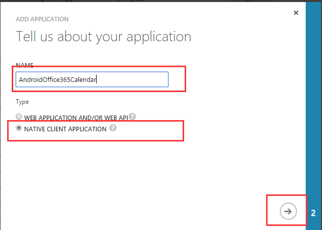
8. On the Application information page, specify a **Redirect URI**. For this example, you can specify **http://AndroidOffice365Calendar** and then click the **Checkmark** icon.
9. Once the application has been successfully added, the Quick Start page for the application is displayed.
10. Click the **CONFIGURE** tab.<br/>
	
11. Click the **Add application** button.<br/>
	
12. Click the service **Microsoft Graph** (or click the plus symbol to add the service) to add the service to the list on the right, then click the **Checkmark** icon to save your selections.<br/>
	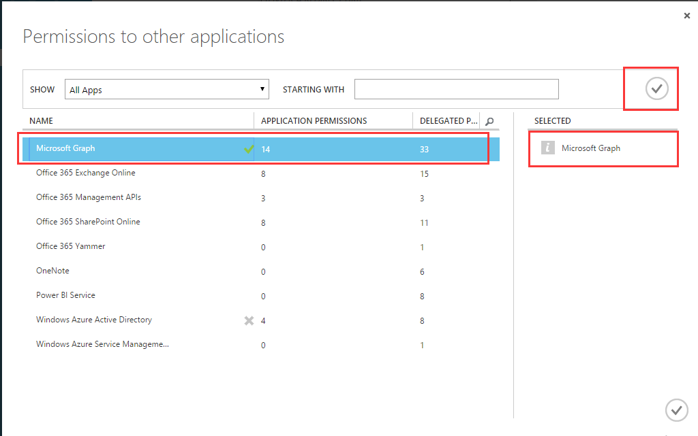
14. Under **permissions to other applications** section, click the **Delegated Permissions** cell in the **Microsoft Graph** row, and check the **Have full access to user calendars** and **Sign in and read user profile** permissions.
15. Click the **SAVE** button on the bottom menu.<br/>
	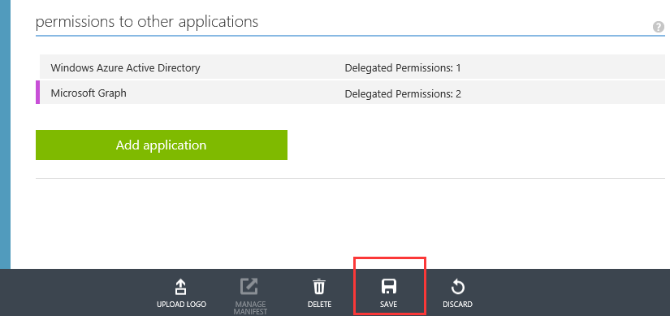

## Code your app ##
1. Go back to the **Android Studio**.
2. Open the file **AndroidMainifset.xml** and add the permissions below.

	````xml
	<uses-permission android:name="android.permission.INTERNET" />
	<uses-permission android:name="android.permission.ACCESS_NETWORK_STATE" />
	````
	
	

3. Right click **com.microsoft.androidoffice365calendar** and select New, then click **Java Class**.<br/>
	
4. Fill in **Constants** and select **Interface**, then click **OK** button.<br/>
	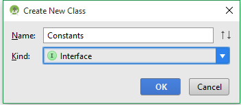
5. The source code of the file **Constants.java** will be the following, modify the values of **AAD_CLIENT_ID** and **AAD_REDIRECT_URL** to the actual ones.

    ````java
	package com.microsoft.androidoffice365calendar;

	public interface Constants {
	    public static final String AAD_CLIENT_ID = "Your app client ID";
	    public static final String AAD_REDIRECT_URL = "Your app redirect URL";
	    public static final String AAD_AUTHORITY = "https://login.microsoftonline.com/common";
	    public static final String GRAPH_RESOURCE_ID = "https://graph.microsoft.com/";
	    public static final String GRAPH_RESOURCE_URL = "https://graph.microsoft.com/v1.0/";
	}
	````

	**NOTE: You can find the client ID and redirect url in Microsoft Azure**

	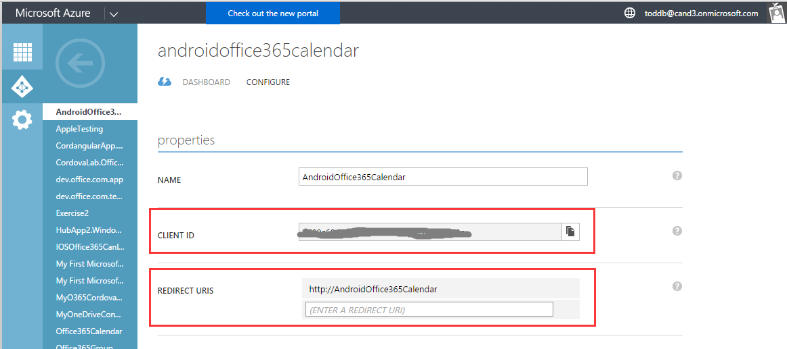
6. Add new class file **AuthenticationController.java**.<br/>
	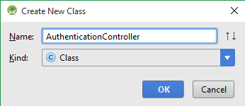
7. The source code of the file **AuthenticationController.java** will be the following.

	````java
	package com.microsoft.androidoffice365calendar;

	import android.app.Activity;
	import android.util.Log;

	import com.google.common.util.concurrent.SettableFuture;
	import com.microsoft.aad.adal.AuthenticationCallback;
	import com.microsoft.aad.adal.AuthenticationContext;
	import com.microsoft.aad.adal.AuthenticationResult;
	import com.microsoft.aad.adal.PromptBehavior;
	import com.microsoft.services.orc.auth.AuthenticationCredentials;
	import com.microsoft.services.orc.core.DependencyResolver;
	import com.microsoft.services.orc.http.Credentials;
	import com.microsoft.services.orc.http.impl.OAuthCredentials;
	import com.microsoft.services.orc.http.impl.OkHttpTransport;
	import com.microsoft.services.orc.serialization.impl.GsonSerializer;

	public class AuthenticationController {
	    private final String TAG = "Authentication";
	    private AuthenticationContext authContext;
	    private DependencyResolver dependencyResolver;
	    private Activity contextActivity;
	    private String resourceId;

	    public static synchronized AuthenticationController getInstance() {
	        if (INSTANCE == null) {
	            INSTANCE = new AuthenticationController();
	        }
	        return INSTANCE;
	    }
	    private static AuthenticationController INSTANCE;

	    private AuthenticationController() {
	        resourceId = Constants.GRAPH_RESOURCE_ID;
	    }

	    public void setContextActivity(final Activity contextActivity) {
	        this.contextActivity = contextActivity;
	    }

	    public SettableFuture<Boolean> initialize() {
	        final SettableFuture<Boolean> result = SettableFuture.create();

	        if (verifyAuthenticationContext()) {
	            getAuthenticationContext().acquireToken(
	                    this.contextActivity,
	                    this.resourceId,
	                    Constants.AAD_CLIENT_ID,
	                    Constants.AAD_REDIRECT_URL,
	                    PromptBehavior.Auto,
	                    new AuthenticationCallback<AuthenticationResult>() {
	                        @Override
	                        public void onSuccess(final AuthenticationResult authenticationResult) {
	                            if (authenticationResult != null && authenticationResult.getStatus() == AuthenticationResult.AuthenticationStatus.Succeeded) {
	                                dependencyResolver = new DependencyResolver.Builder(
                                        new OkHttpTransport(), new GsonSerializer(),
                                        new AuthenticationCredentials() {
                                            @Override
                                            public Credentials getCredentials() {
                                                return new OAuthCredentials(authenticationResult.getAccessToken());
                                            }
                                        }).build();
	                                result.set(true);
	                            }
	                        }

	                        @Override
	                        public void onError(Exception t) {
	                            Log.e(TAG, "Acquire token failed. " + t.getMessage());
	                            result.setException(t);
	                        }
	                    });
	        } else {
	            result.setException(new Throwable("Auth context verification failed."));
	        }
	        return result;
    	}

    	public AuthenticationContext getAuthenticationContext() {
    	    if (authContext == null) {
    	        try {
    	            authContext = new AuthenticationContext(this.contextActivity, Constants.AAD_AUTHORITY, false);
    	        } catch (Throwable t) {
    	            Log.e(TAG, "Get AuthenticationContext failed. " + t.toString());
    	        }
    	    }
    	    return authContext;
    	}

    	public DependencyResolver getDependencyResolver() {
    	    return getInstance().dependencyResolver;
    	}

    	private boolean verifyAuthenticationContext() {
    	    if (this.contextActivity == null) {
    	        return false;
    	    }
    	    return true;
    	}
	}
	````

8. Create new class file **GraphController.java**.<br/>
	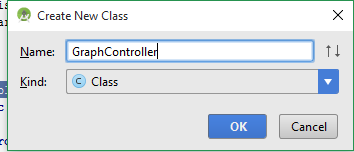
9. The source code of the file **GraphController.java** will be the following.

	````java
	package com.microsoft.androidoffice365calendar;

	import android.util.Log;

	import com.google.common.util.concurrent.FutureCallback;
	import com.google.common.util.concurrent.Futures;
	import com.google.common.util.concurrent.SettableFuture;
	import com.microsoft.services.graph.Event;
	import com.microsoft.services.graph.fetchers.GraphServiceClient;
	import com.microsoft.services.orc.core.DependencyResolver;
	import com.microsoft.services.orc.core.OrcList;

	import java.text.SimpleDateFormat;
	import java.util.ArrayList;
	import java.util.Calendar;
	import java.util.List;

	public class GraphController {
    	private final static String TAG = "GraphController";

	    public static synchronized GraphController getInstance() {
	        if (INSTANCE == null) {
	            INSTANCE = new GraphController();
	        }
	        return INSTANCE;
	    }
	    private static GraphController INSTANCE;

	    public SettableFuture<List<String>> initialize() {
	        SimpleDateFormat formatter = new SimpleDateFormat("yyyy-MM-dd");
	        Calendar calendar = Calendar.getInstance();
	        int day = calendar.get(Calendar.DAY_OF_MONTH) - 30;
	        calendar.set(Calendar.DAY_OF_MONTH,day);
	        String filterDate = formatter.format(calendar.getTime());
	        final SettableFuture<List<String>> result = SettableFuture.create();
	        final List<String> events = new ArrayList<String>();

	        DependencyResolver dependencyResolver = AuthenticationController.getInstance().getDependencyResolver();
	        GraphServiceClient graphServiceClient = new GraphServiceClient(Constants.GRAPH_RESOURCE_URL,dependencyResolver);
	        try {
	            Futures.addCallback(graphServiceClient.getMe().getEvents()
                    .filter("Start/DateTime ge '" + filterDate + "'")
                    .select("subject,start,end")
                    .orderBy("Start/DateTime desc")
                    .top(10000).read(), new FutureCallback<OrcList<Event>>() {
						@Override
						public void onSuccess(OrcList<Event> list) {
						    for (Event event : list) {
                			    events.add(event.getSubject());
		               	    }
			           	    result.set(events);
				    	}

				    	@Override
				    	public void onFailure(Throwable t) {
				    	    Log.e(TAG, "Get events failed. " + t.getMessage());
				    	    result.setException(t);
				    	}
		            });
    	    } catch (Exception e) {
    	        Log.e(TAG, "Initialize failed. " + e.getMessage());
    	        result.setException(e);
    	    }
    	    return result;
    	}
	}
	````

10. Open the file **activity_main.xml**.<br/>
	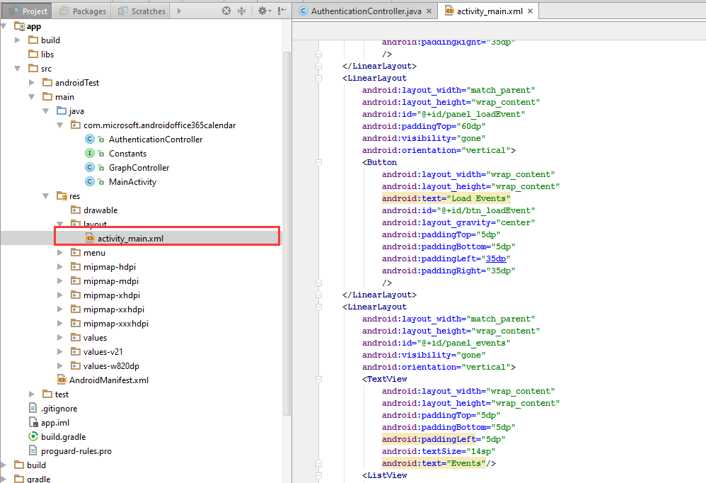
11. Copy the code below to the file **activity_main.xml**:

	````xml
	<?xml version="1.0" encoding="utf-8"?>
	<LinearLayout xmlns:android="http://schemas.android.com/apk/res/android"
	    android:orientation="vertical"
	    android:layout_width="match_parent"
	    android:layout_height="match_parent">

    	<LinearLayout
    	    android:layout_width="match_parent"
    	    android:layout_height="wrap_content"
    	    android:id="@+id/panel_signIn"
    	    android:paddingTop="60dp"
    	    android:visibility="visible"
    	    android:orientation="vertical">
    	    <Button
    	        android:layout_width="wrap_content"
    	        android:layout_height="wrap_content"
    	        android:text="Sign In"
    	        android:id="@+id/btn_signIn"
    	        android:layout_gravity="center"
    	        android:paddingTop="5dp"
    	        android:paddingBottom="5dp"
    	        android:paddingLeft="35dp"
    	        android:paddingRight="35dp"
    	        />
	    </LinearLayout>
    	<LinearLayout
    	    android:layout_width="match_parent"
    	    android:layout_height="wrap_content"
    	    android:id="@+id/panel_loadEvent"
    	    android:paddingTop="60dp"
    	    android:visibility="gone"
    	    android:orientation="vertical">
    	    <Button
    	        android:layout_width="wrap_content"
    	        android:layout_height="wrap_content"
    	        android:text="Load Events"
    	        android:id="@+id/btn_loadEvent"
    	        android:layout_gravity="center"
    	        android:paddingTop="5dp"
    	        android:paddingBottom="5dp"
    	        android:paddingLeft="35dp"
    	        android:paddingRight="35dp"
    	        />
    	</LinearLayout>
    	<LinearLayout
    	    android:layout_width="match_parent"
    	    android:layout_height="wrap_content"
    	    android:id="@+id/panel_events"
    	    android:visibility="gone"
    	    android:orientation="vertical">
    	    <TextView
    	        android:layout_width="wrap_content"
    	        android:layout_height="wrap_content"
    	        android:paddingTop="5dp"
    	        android:paddingBottom="5dp"
    	        android:paddingLeft="5dp"
    	        android:textSize="14sp"
    	        android:text="Events"/>
    	    <ListView
    	        android:layout_width="wrap_content"
    	        android:layout_height="wrap_content"
    	        android:id="@+id/list_events"
    	        android:padding="0dp"
    	        android:paddingLeft="0dp"
    	        android:paddingTop="0dp"
    	        android:paddingRight="0dp"
    	        android:paddingBottom="0dp" />
    	</LinearLayout>

	</LinearLayout>
	````

12. Open the file **MainActivity.java**.<br/>
	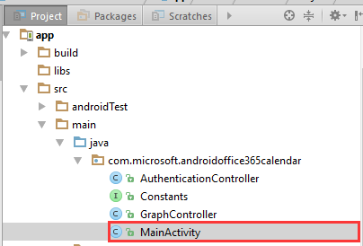
13. Copy the code below to the file **MainActivity.java**.

	````java
	package com.microsoft.androidoffice365calendar;

	import android.app.Activity;
	import android.app.ProgressDialog;
	import android.os.Bundle;
	import android.view.View;
	import android.widget.ArrayAdapter;
	import android.widget.Button;
	import android.util.Log;
	import android.content.Intent;

	import com.google.common.util.concurrent.FutureCallback;
	import com.google.common.util.concurrent.Futures;
	import com.google.common.util.concurrent.SettableFuture;

	import android.widget.ListView;
	import android.widget.LinearLayout;
	import android.widget.Toast;

	import java.util.List;

	public class MainActivity extends Activity {
    	private final static String TAG = "MainActivity";
    	private ProgressDialog process;
    	private ListView listEvents;
    	private LinearLayout panelSignIn;
    	private LinearLayout panelEvents;
    	private LinearLayout panelLoadEvent;

    	@Override
    	protected void onCreate(Bundle savedInstanceState) {
    	    super.onCreate(savedInstanceState);
    	    setContentView(R.layout.activity_main);
	
    	    listEvents = (ListView)findViewById(R.id.list_events);
    	    panelSignIn = (LinearLayout)findViewById(R.id.panel_signIn);
    	    panelEvents = (LinearLayout)findViewById(R.id.panel_events);
    	    panelLoadEvent = (LinearLayout)findViewById(R.id.panel_loadEvent);
	
    	    ((Button)findViewById(R.id.btn_signIn)).setOnClickListener(new View.OnClickListener() {
    	        @Override
    	        public void onClick(View view) {
    	            signIn();
    	        }
    	    });

    	    ((Button)findViewById(R.id.btn_loadEvent)).setOnClickListener(new View.OnClickListener() {
    	        @Override
    	        public void onClick(View view) {
    	            loadEvents();
    	        }
    	    });

    	    setPanelVisibility(true,false,false);
    	}

    	private void signIn() {
    	    AuthenticationController.getInstance().setContextActivity(this);
    	    SettableFuture<Boolean> authenticated = AuthenticationController.getInstance().initialize();

    	    Futures.addCallback(authenticated, new FutureCallback<Boolean>() {
    	        @Override
    	        public void onSuccess(Boolean result) {
    	            runOnUiThread(new Runnable() {
    	                @Override
    	                public void run() {
    	                    Toast.makeText(MainActivity.this,"Sign in successfully.",Toast.LENGTH_SHORT).show();
    	                    setPanelVisibility(false,true,false);
    	                }
    	            });
    	        }
    	        @Override
    	        public void onFailure(final Throwable t) {
    	            runOnUiThread(new Runnable() {
    	                @Override
    	                public void run() {
    	                    Toast.makeText(MainActivity.this,"Sign in failed.",Toast.LENGTH_LONG).show();
	                        Log.e(TAG, "Sign in failed. " + t.getMessage());
    	                }
    	            });
    	        }
    	    });
    	}

    	private void loadEvents(){
    	    process = ProgressDialog.show(this,"Loading","Loading events in the past 30 days...");
    	    SettableFuture<List<String>> graphController = GraphController.getInstance().initialize();
    	    Futures.addCallback(graphController, new FutureCallback<List<String>>() {
    	        @Override
    	        public void onSuccess(final List<String> result) {
    	            runOnUiThread(new Runnable() {
    	                @Override
    	                public void run() {
    	                    Toast.makeText(MainActivity.this,"Load event successfully.",Toast.LENGTH_LONG).show();
    	                    process.dismiss();
    	                    bindEvents(result);
    	                }
    	            });
    	        }

    	        @Override
    	        public void onFailure(final Throwable t) {
    	            runOnUiThread(new Runnable() {
    	                @Override
    	                public void run() {
    	                    Log.e(TAG, "Load event failed. " + t.getMessage());
    	                    process.dismiss();
    	                    Toast.makeText(MainActivity.this,"Load event failed.",Toast.LENGTH_LONG).show();
    	                }
    	            });
    	        }
    	    });
    	}

    	private void bindEvents(List<String> events){
    	    setPanelVisibility(false,false,true);
    	    ArrayAdapter<String> adapter = new ArrayAdapter<String>(this,android.R.layout.simple_expandable_list_item_1,events);
    	    listEvents.setAdapter(adapter);
    	}

    	private void setPanelVisibility(Boolean showSignIn, Boolean showLoadEvents, Boolean showList){
    	    panelSignIn.setVisibility(showSignIn ? View.VISIBLE : View.GONE);
    	    panelLoadEvent.setVisibility(showLoadEvents ? View.VISIBLE : View.GONE);
    	    panelEvents.setVisibility(showList ? View.VISIBLE : View.GONE);
    	}

    	@Override
    	protected void onActivityResult(int requestCode, int resultCode, Intent data) {
    	    Log.i(TAG, "AuthenticationActivity has come back with results");
    	    super.onActivityResult(requestCode, resultCode, data);
    	    AuthenticationController
    	            .getInstance()
    	            .getAuthenticationContext()
    	            .onActivityResult(requestCode, resultCode, data);
    	}

	}
	````

14. Run your app.<br/>
	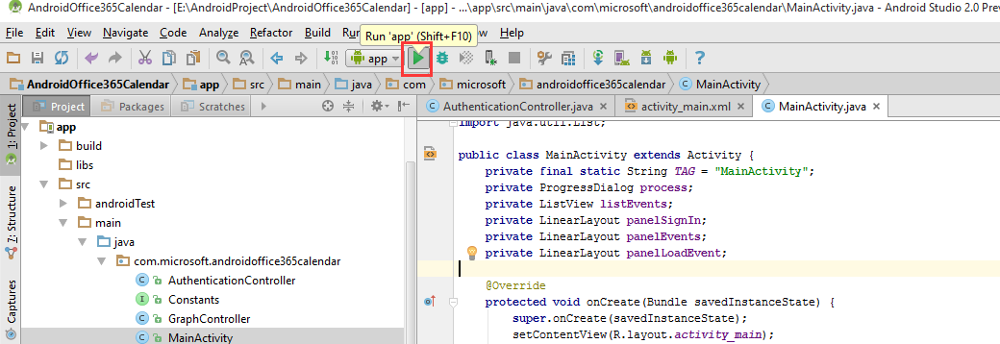
15. Select **API 23** emulator and click **OK**.
	**NOTE: If there is no such emulator please create a new one.**

	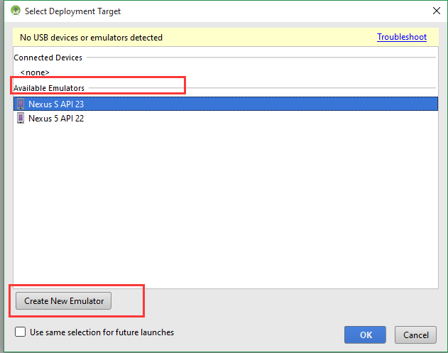
16. The emulator will be shown.<br/>
	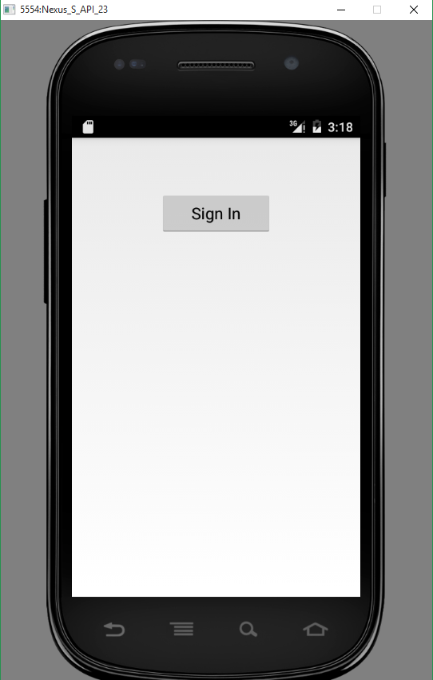
17. Click **Sign In**.
18. Fill in your user name and password, then click **Sign in**.<br/>
	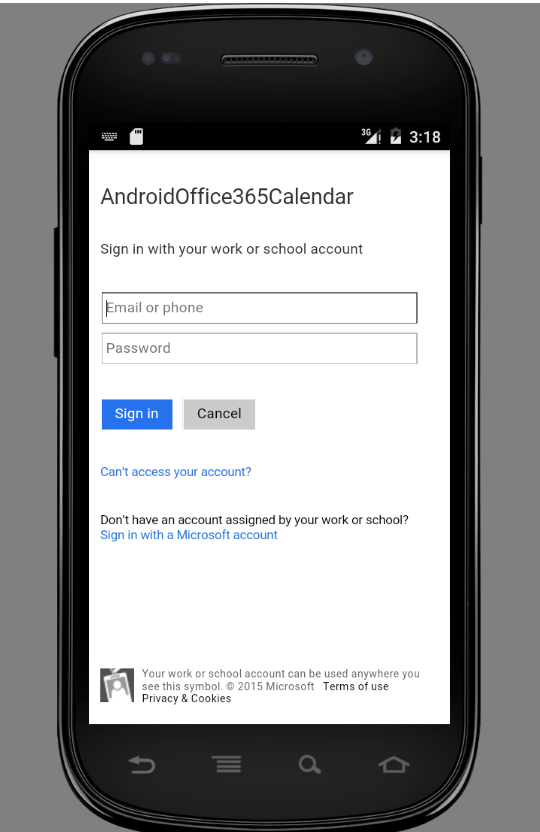
19. Click the **Load Events** button.<br/>
	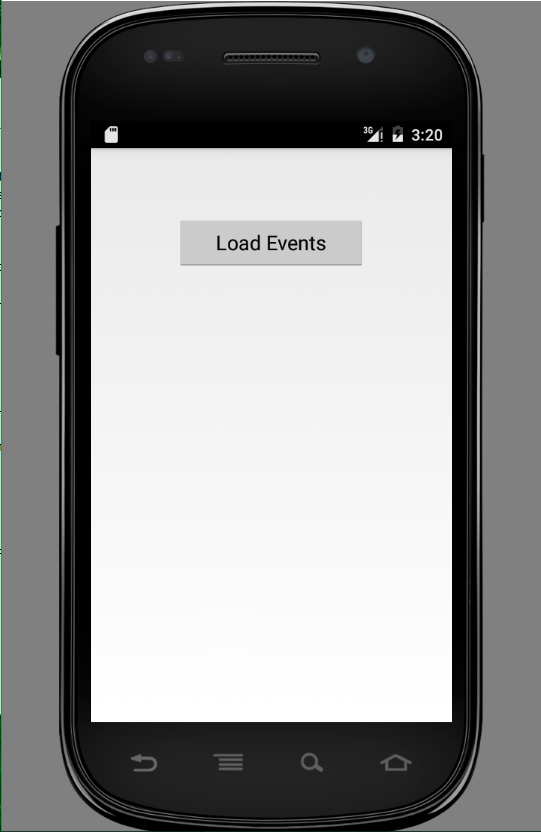
20. The events will be shown.

