# Microsoft Graph for Mail
In this lab, you will use Microsoft Graph to program against an Office 365 mailbox as part of an ASP.NET MVC5 application.

## Prerequisites
1. You must have an Office 365 tenant and Microsoft Azure subscription to complete this lab. If you do not have one, the lab for **O3651-7 Setting up your Developer environment in Office 365** shows you how to obtain a trial. 
1. You must have Visual Studio 2015 with Update 1 installed.

## Exercise 1: Create an ASP.NET MVC5 Application
In this exercise, you will create the ASP.NET MVC5 application and register it with Azure active Directory.

1. Launch **Visual Studio 2015** as an administrator. 
1. In Visual Studio select **File/New/Project**.
1. In the **New Project** dialog, select **Templates/Visual C#/Web** and click **ASP.NET Web Application**. Name the new project **Office365Mail** and then click **OK**.  
    
    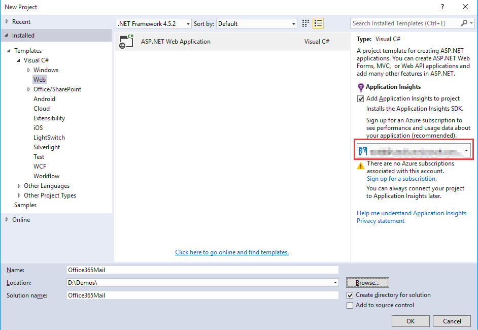
    > NOTE: You need sign up for your Azure subscription.
    
1. In the **New ASP.NET Project** dialog, click **MVC** and then click **Change Authentication**.
1. Select **Work And School Accounts**, check **Read directory data** and click **OK**.

	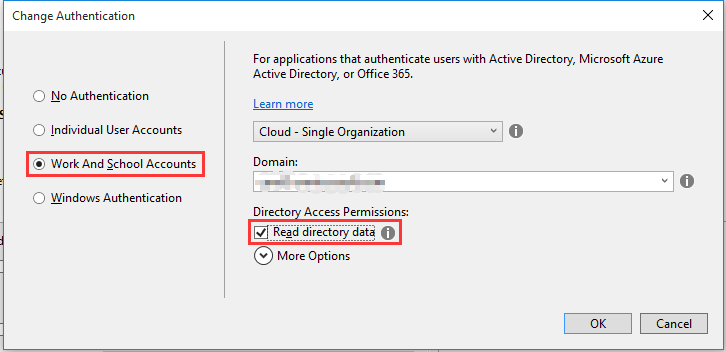

1. Once the **New ASP.NET Project** dialog appears like the following screenshot, click **OK**. 

	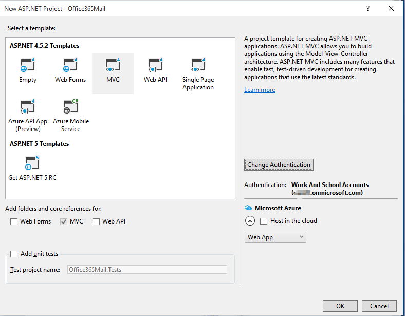
    
1. At this point you can test the authentication flow for your application.
  1. In Visual Studio, press **F5**. The browser will automatically launch taking you to the HTTPS start page for the web application.

   > **Note:** If you receive an error that indicates ASP.NET could not connect to the SQL database, please see the [SQL Server Database Connection Error Resolution document](../../SQL-DB-Connection-Error-Resolution.md) to quickly resolve the issue. 

  1. To sign in, click the **Sign In** link in the upper-right corner.
  1. Login using your **Organizational Account**.
  1. Upon a successful login, since this will be the first time you have logged into this app, Azure AD will present you with the common consent dialog that looks similar to the following image:

    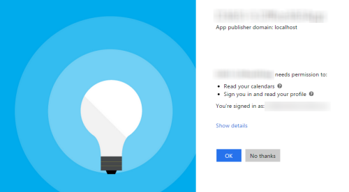
  1. Click **OK** to approve the app's permission request on your data in Office 365.
  1. You will then be redirected back to your web application. However notice in the upper right corner, it now shows your email address & the **Sign Out** link.

Congratulations... at this point your app is configured with Azure AD and leverages OpenID Connect and OWIN to facilitate the authentication process!

## Grant App Necessary Permissions
1. Browse to the [Azure Management Portal](https://manage.windowsazure.com) and sign in with your **Organizational Account**.
2. In the left-hand navigation, click **Active Directory**.
3. Select the directory you share with your Office 365 subscription.
4. Search for this app with the **ida:ClientId** that was created in exercise 1.

    
5. Select the application. 
6. Open the **Configure** tab.
7. Scroll down to the **permissions to other applications** section. 
8. Click the **Add Application** button.
9. In the **Permissions to other applications** dialog, click the **PLUS** icon next to the **Microsoft Graph** option.
10. Click the **Check mark** icon in the lower right corner.
11. For the new **Microsoft Graph** application permission entry, select the **Delegated Permissions** dropdown on the same line and then select the following permissions:
    * **Read and write access to user mail**
    * **Send mail as a user**
12. Click the **Save** button at the bottom of the page.

## Exercise 2: Code the Mail API
In this exercise, you will create a repository object for wrapping CRUD operations associated with the Mail API.

1. In the **Solution Explorer**, create a new folder named **Util**.

    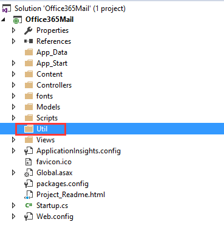

2. Right-click the **Util** folder and select **Add/Class**, in the **Add New Item** dialog, name the new class **JsonExtensions** and click **Add** to create the new source file for the class. 
3. At the top of the **JsonExtensions.cs** file, remove all the using statements and add the following using statements.

	```c#
    using System;
    using Newtonsoft.Json.Linq;
	```

4. Implement the new class **JsonExtensions** using the following class definition.

    ```c#
    public static class JsonExtensions
    {
        public static bool IsNullOrEmpty(this JToken token)
        {
            return (token == null) ||
                   (token.Type == JTokenType.Array && !token.HasValues) ||
                   (token.Type == JTokenType.Object && !token.HasValues) ||
                   (token.Type == JTokenType.String && token.ToString() == String.Empty) ||
                   (token.Type == JTokenType.Null);
        }
    }
    ```

    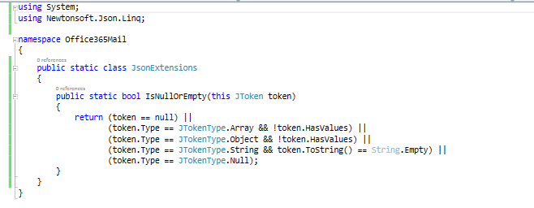
5. In the **Solution Explorer**, locate the **Models** folder in the **Office365Mail** project.
6. Right-click the **Models** folder and select **Add/Class**, in the **Add New Item** dialog, name the new class **MyMessage** and click **Add** to create the new source file for the class. 
7. At the top of the **MyMessage.cs** file, add the following using statements just after the using statements that are already there.

	```c#
	using System.ComponentModel;
    using System.ComponentModel.DataAnnotations;
	```

8. Implement the new class **MyMessage** using the following class definition.
		
      ```c#
      public class MyMessage
      {
        public string Id { get; set; }
        public string ConversationId { get; set; }
        public string Subject { get; set; }
        [DisplayName("From Name")]
        public string FromName { get; set; }
        [DisplayName("From Email Address")]
        public string FromEmailAddress { get; set; }
        [DisplayName("Sent")]
        [DisplayFormat(DataFormatString = "{0:dddd MMMM d, yyyy}")]
        public DateTimeOffset? DateTimeSent { get; set; }
        [DisplayName("Received")]
        [DisplayFormat(DataFormatString = "{0:dddd MMMM d, yyyy}")]
        public DateTimeOffset? DateTimeReceived { get; set; }
        [DisplayName("Has Attachments")]
        public bool? HasAttachments { get; set; }
        public string Importance { get; set; }
        public bool? IsDraft { get; set; }
        [DisplayName("To Name")]
        public string ToName { get; set; }
        [DisplayName("To Email Address")]
        public string ToEmailAddress { get; set; }
        public string Body { get; set; }
      }
      ```

9. Right-click the **Models** folder and select **Add/Class**. In the **Add New Item** dialog, name the new class **MyMessagesRespository** and click **Add** to create the new source file for the class.    
10. **Add** the following using statements to the top of the **MyMessagesRespository** class.
		
	```c#
    using System.Text;
	using System.Net.Http;
	using System.Net.Http.Headers;
	using System.Diagnostics;
	using Newtonsoft.Json;
	using Newtonsoft.Json.Linq;
	using System.Threading.Tasks;
	using System.Configuration;
	using System.Security.Claims;
	using Microsoft.IdentityModel.Clients.ActiveDirectory;
	using Office365Mail.Util;
	```

11. **Add** the following definition to **MyMessagesRespository** class.

     ```c#
     private string GraphResourceUrl = "https://graph.microsoft.com/V1.0/";
     public bool MorePagesAvailable = false;
     ```

12. **Add** a function named **GetGraphAccessTokenAsync** to the **MyMessagesRespository** class to retrieve an Access Token.

    ```c#
    public static async Task<string> GetGraphAccessTokenAsync()
    {
        var AzureAdGraphResourceURL = "https://graph.microsoft.com/";
        var Authority = ConfigurationManager.AppSettings["ida:AADInstance"] + ConfigurationManager.AppSettings["ida:TenantId"];

        var signInUserId = ClaimsPrincipal.Current.FindFirst(ClaimTypes.NameIdentifier).Value;
        var userObjectId = ClaimsPrincipal.Current.FindFirst("http://schemas.microsoft.com/identity/claims/objectidentifier").Value;
        var clientCredential = new ClientCredential(ConfigurationManager.AppSettings["ida:ClientId"], ConfigurationManager.AppSettings["ida:ClientSecret"]);
        var userIdentifier = new UserIdentifier(userObjectId, UserIdentifierType.UniqueId);

        // create auth context
        AuthenticationContext authContext = new AuthenticationContext(Authority, new ADALTokenCache(signInUserId));
        var result = await authContext.AcquireTokenSilentAsync(AzureAdGraphResourceURL, clientCredential, userIdentifier);

        return result.AccessToken;
    }
    ```

13. **Add** a function named **GetJsonAsync** to the **MyMessagesRespository** class.

    ```c#
    public static async Task<string> GetJsonAsync(string url)
    {
        string accessToken = await GetGraphAccessTokenAsync();
        using (HttpClient client = new HttpClient())
        {
            client.DefaultRequestHeaders.Add("Accept", "application/json");
            client.DefaultRequestHeaders.Authorization = new AuthenticationHeaderValue("Bearer", accessToken);

            using (var response = await client.GetAsync(url))
            {
                if (response.IsSuccessStatusCode)
                    return await response.Content.ReadAsStringAsync();
                return null;
            }
        }
    } 
    ```

14. **Add** a function named **GetMessages** to the **MyMessagesRespository** class to retrieve and return a list of **MyMessage** objects.
		
      ```c#
	   public async Task<List<MyMessage>> GetMessages(int pageIndex, int pageSize)
	    {
	
	        List<MyMessage> messageList = new List<MyMessage>();
	        try
	        {
	            string restURL = string.Format("{0}/me/messages?$orderby=SentDateTime desc&$skip={1}&$top={2}", GraphResourceUrl, pageIndex * pageSize, pageSize);
	            string responseString = await GetJsonAsync(restURL);
	            if (responseString != null)
	            {
	                MorePagesAvailable = !JObject.Parse(responseString)["@odata.nextLink"].IsNullOrEmpty();
	                var jsonresult = JObject.Parse(responseString)["value"];
	                foreach (var item in jsonresult)
	                {
	                    var msg = new MyMessage();
	                    msg.Id = item["id"].IsNullOrEmpty() ? string.Empty : item["id"].ToString();
	                    msg.Subject = item["subject"].IsNullOrEmpty() ? string.Empty : item["subject"].ToString();
	                    msg.DateTimeReceived = item["receivedDateTime"].IsNullOrEmpty() ? new DateTime() : DateTime.Parse(item["receivedDateTime"].ToString());
	                    if (!item["from"].IsNullOrEmpty() && !item["from"]["emailAddress"].IsNullOrEmpty())
	                    {
	                        msg.FromName = item["from"]["emailAddress"]["name"].IsNullOrEmpty() ? string.Empty : item["from"]["emailAddress"]["name"].ToString();
	                        msg.FromEmailAddress = item["from"]["emailAddress"]["address"].IsNullOrEmpty() ? string.Empty : item["from"]["emailAddress"]["address"].ToString();
	                    }
	                    if (!item["toRecipients"].IsNullOrEmpty())
	                    {
	                        var to = item["toRecipients"].ToArray();
	                        if (!to[0]["emailAddress"].IsNullOrEmpty())
	                        {
	                            msg.ToName = to[0]["emailAddress"]["name"].IsNullOrEmpty() ? string.Empty : to[0]["emailAddress"]["name"].ToString();
	                            msg.ToEmailAddress = to[0]["emailAddress"]["address"].IsNullOrEmpty() ? string.Empty : to[0]["emailAddress"]["address"].ToString();
	                        }
	                    }
	
	                    messageList.Add(msg);
	                }
	            }
	        }
	
	        catch (Exception el)
	        {
	            Debug.WriteLine("GetMessages error: " + el.ToString());
	        }
	        return messageList;
	    }
      ```

15. Add a function named **GetMessage** to the **MyMessagesRespository** class to get a specific message:
   
    ```c#
	public async Task<MyMessage> GetMessage(string id)
    {
        try
        {
            var restURL = string.Format("{0}/me/messages/{1}", GraphResourceUrl, id);
            string responseString = await GetJsonAsync(restURL);

            if (responseString != null)
            {
                var jsonresult = JObject.Parse(responseString);
                var msg = new MyMessage();
                msg.Id = jsonresult["id"].IsNullOrEmpty() ? string.Empty : jsonresult["id"].ToString();
                msg.Subject = jsonresult["subject"].IsNullOrEmpty() ? string.Empty : jsonresult["subject"].ToString();
                msg.DateTimeReceived = jsonresult["receivedDateTime"].IsNullOrEmpty() ? new DateTime() : DateTime.Parse(jsonresult["receivedDateTime"].ToString());
                msg.DateTimeSent = jsonresult["sentDateTime"].IsNullOrEmpty() ? new DateTime() : DateTime.Parse(jsonresult["sentDateTime"].ToString());

                if (!jsonresult["from"].IsNullOrEmpty() && !jsonresult["from"]["emailAddress"].IsNullOrEmpty())
                {
                    msg.FromName = jsonresult["from"]["emailAddress"]["name"].IsNullOrEmpty() ? string.Empty : jsonresult["from"]["emailAddress"]["name"].ToString();
                    msg.FromEmailAddress = jsonresult["from"]["emailAddress"]["address"].IsNullOrEmpty() ? string.Empty : jsonresult["from"]["emailAddress"]["address"].ToString();
                }
                if (!jsonresult["toRecipients"].IsNullOrEmpty())
                {
                    var to = jsonresult["toRecipients"].ToArray();
                    if (!to[0]["emailAddress"].IsNullOrEmpty())
                    {
                        msg.ToName = to[0]["emailAddress"]["name"].IsNullOrEmpty() ? string.Empty : to[0]["emailAddress"]["name"].ToString();
                        msg.ToEmailAddress = to[0]["emailAddress"]["address"].IsNullOrEmpty() ? string.Empty : to[0]["emailAddress"]["address"].ToString();
                    }
                }
                if (!jsonresult["body"].IsNullOrEmpty())
                {
                    msg.Body = jsonresult["body"]["content"].IsNullOrEmpty() ? string.Empty : jsonresult["body"]["content"].ToString();
                }

                return msg;
            }
        }

        catch (Exception el)
        {
            Debug.WriteLine("GetMessage error: " + el.ToString());
        }
        return null;
    }
    ```

16. Add a function named **DeleteMessage** to the **MyMessagesRespository** class to delete a message.

    ```c#
    public async Task<bool> DeleteMessage(string id)
    {
        var restURL = string.Format("{0}/me/messages/{1}", GraphResourceUrl, id);

        string accessToken = await GetGraphAccessTokenAsync();
        using (HttpClient client = new HttpClient())
        {
            client.DefaultRequestHeaders.Add("Accept", "application/json");
            client.DefaultRequestHeaders.Authorization = new AuthenticationHeaderValue("Bearer", accessToken);

            using (var response = await client.DeleteAsync(restURL))
            {
                if (response.IsSuccessStatusCode)
                    return true;
                else
                    Debug.WriteLine("DeleteMessage error: " + response.StatusCode);
            }
        }
        
        return false;
    }
    ```

17. Add a function named **SendMessage** to the **MyMessagesRespository** class to send an email message.

    ```c#
    public async Task SendMessage(MyMessage myMessage)
    {
        var restURL = string.Format("{0}/me/Microsoft.Graph.sendMail", GraphResourceUrl);
        string accessToken = await GetGraphAccessTokenAsync();
        using (HttpClient client = new HttpClient())
        {
            client.DefaultRequestHeaders.Add("Accept", "application/json");
            client.DefaultRequestHeaders.Authorization = new AuthenticationHeaderValue("Bearer", accessToken);
            var to = new { EmailAddress = new { Name = myMessage.ToName, Address = myMessage.ToEmailAddress } };
            var msg = new
            {
                Message = new
                {
                    Subject = myMessage.Subject,
                    Body = new
                    {
                        ContentType = "TEXT",
                        Content = myMessage.Body
                    },
                    ToRecipients = new[] { to }
                },
                SaveToSentItems = true
            };
            string postBody = JsonConvert.SerializeObject(msg);
            using (var response = await client.PostAsync(restURL, new StringContent(postBody, Encoding.UTF8, "application/json")))
            {
                if (response.IsSuccessStatusCode)
                    return;
                else
                    Debug.WriteLine("SendMessage error: " + response.StatusCode);
            }
        }
    }
    ```

At this point you have created the repository that will be used to talk to Microsoft Graph.

## Exercise 3: Code the MVC Application
In this exercise, you will code the **MailController** of the MVC application to display messages as well as add behavior for sending and deleting messages.

1. Right-click the **Controllers** folder and select **Add/Controller**.
  1. In the **Add Scaffold** dialog, select **MVC 5 Controller - Empty**, click **Add**.
  1. When prompted for a name, enter **MailController**, click **Add**.

2. Within the **MailController** file, add the following `using` statements to the top of the file:

    ```c#
    using System.Threading.Tasks;
    using Office365Mail.Models;
    ```

3. Add **[Authorize]** on the top **MailController**.

    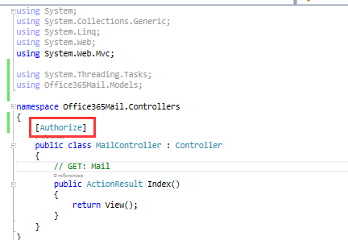

4. Within the `MailController` class, add the following field to get a reference to the repository you previously created:

    ```c#
    MyMessagesRespository _repo = new MyMessagesRespository();
    ```

7. Add a route handler and view to list all the messages:
  1. **Replace** the **Index** method with the following code to read files.
          
     ```c#
     public async Task<ActionResult> Index(int? pageNumber)
     {
         const int pageSize = 10;
         if (pageNumber == null)
             pageNumber = 1;
         var messages = await _repo.GetMessages((int)pageNumber - 1, pageSize);
         ViewBag.pageNumber = pageNumber;
         ViewBag.morePagesAvailable =_repo.MorePagesAvailable;
         return View(messages);

     }
     ```
     > Notice how the route handler takes in an optional parameter for the page number. This will be used to implement paging for the controller. Right now the page size is small, set to 10, for demonstration purposes. Also notice how the repository has a public property `ModePagesAvailable` that indicates if there are more pages of results as reported by Microsoft Graph.

  2. Update the view to display the messages list.
    1. Within the `MailController` class, right click the `View()` at the end of the `Index()` method and select **Add View**.
    2. Within the **Add View** dialog, set the following values:
       1. View Name: **Index**.
       2. Template: **Empty (without model)**.
         > Leave all other fields blank & unchecked.
       3. Click **Add**.<br/>

          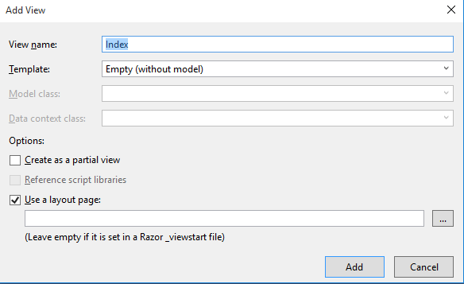

       4. Within the **Views/Mail/Index.cshtml** file, delete all the code in the file and replace it with the following code:
            
	      ```html
	      @model IEnumerable<Office365Mail.Models.MyMessage>
	
	      @{
			  ViewBag.Title = "Index";
		   }
			
		  <h2>Index</h2>
			
		  <p>
			  @Html.ActionLink("Create New Message", "Send")
		  </p>
          <table class="table">
		    <tr>
		        <th>@Html.DisplayNameFor(model => model.Subject)</th>
		        <th>@Html.DisplayNameFor(model => model.DateTimeReceived)</th>
		        <th>From</th>
		        <th>To</th>
		        <th></th>
		    </tr>
			
		    @foreach (var item in Model)
		    {
		        <tr>
		            <td>@Html.DisplayFor(modelItem => item.Subject)</td>
		            <td>@Html.DisplayFor(modelItem => item.DateTimeReceived)</td>
		            <td>
		                @Html.DisplayFor(modelItem => item.FromName)<br />
		                @Html.DisplayFor(modelItem => item.FromEmailAddress)
		            </td>
		            <td>
		                @Html.DisplayFor(modelItem => item.ToName)<br />
		                @Html.DisplayFor(modelItem => item.ToEmailAddress)
		            </td>
		            <td>
		                @Html.ActionLink("Details", "Details", new { id = item.Id }) |
		                @Html.ActionLink("Delete", "Delete", new { id = item.Id })
		            </td>
		        </tr>
		    }
			</table>
	        ```
            
       5. Now at the bottom of the **Index.cshtml** file, add the following code that will implement paging for the index page:
       
           ```html
           <div class="row">
		    <h4>Paging Control</h4>
		    <div class="btn btn-group-sm">
		        @{
		            var pageLinkAttributes = new Dictionary<string, object> { { "class", "btn btn-default" } };
		            int pageNumber = ViewBag.pageNumber;
		            // do prev link if not on first page
		            if (pageNumber > 1)
		            {
		                var routeValues = new RouteValueDictionary { { "pageNumber", pageNumber - 1 } };
		                @Html.ActionLink("Previous Page", "Index", "Mail", routeValues, pageLinkAttributes);
		            }
		            // do next link if current page = max page size
		            if (ViewBag.morePagesAvailable)
		            {
		                var routeValues = new RouteValueDictionary { { "pageNumber", pageNumber + 1 } };
		                @Html.ActionLink("Next Page", "Index", "Mail", routeValues, pageLinkAttributes);
		            }
		        }
		    </div>
		   </div>  
           ```
       6. Open **_Layout.cshtml**, and find **Contact**, use the following **Messages** instead of **Contact**.
    
	      ```html
	      <li>@Html.ActionLink("Messages", "Index", "Mail")</li>
	      ```
	      

    3. Test the new view.
       1. In **Visual Studio**, hit **F5** to begin debugging.

	    > **Note:** If you receive an error that indicates ASP.NET could not connect to the SQL database, please see the [SQL Server Database Connection Error Resolution document](../../SQL-DB-Connection-Error-Resolution.md) to quickly resolve the issue. 

       2. When prompted, log in with your **Organizational Account**.
       3. Once the application has initialized and displays the home page, click the **Messages** menu option and verify that your application displays Mail from your Office 365 account.  
         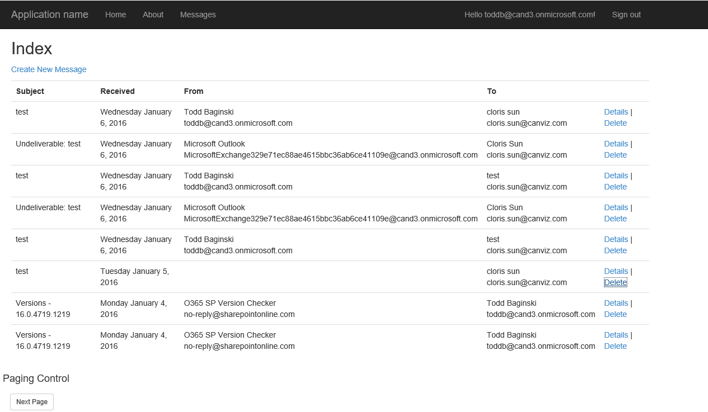
       4. Close the browser window, terminate the debugging session, and return to Visual Studio.

6. Add a route handler to view a message:
  1. In the **MailController.cs** file, add the action method named **Details** that uses the following code to delete a message.
  
     ```c#
     public async Task<ActionResult> Details(string id)
     {
        MyMessage myMessage = null;
        myMessage = await _repo.GetMessage(id);
        return View(myMessage);
     }
     ```
  2. Update the view to display the message detail.
    1. Within the `MailController` class, right click the `View()` at the end of the `Details` method and select **Add View**.
    2. Within the **Add View** dialog, set the following values:
      1. View Name: **Details**.
      2. Template: **Empty (without model)**.
         Leave all other fields blank & unchecked.
      3. Click **Add**.<br/>
      4. Within the **Views/Mail/Details.cshtml** file, delete all the code in the file and replace it with the following code:
         
         ```html
		@model Office365Mail.Models.MyMessage
		@{ ViewBag.Title = "Message Details";}
		<h2>Message Details</h2>
		<div>
		    <h4>MyMessage</h4>
		    <hr />
		    <dl class="dl-horizontal">
		        <dt>@Html.DisplayNameFor(model => model.Subject)</dt>
		        <dd>@Html.DisplayFor(model => model.Subject)</dd>
		        <dt>@Html.DisplayNameFor(model => model.DateTimeSent)</dt>
		        <dd>@Html.DisplayFor(model => model.DateTimeSent)</dd>
		        <dt>@Html.DisplayNameFor(model => model.DateTimeReceived)</dt>
		        <dd>@Html.DisplayFor(model => model.DateTimeReceived)</dd>
		        <dt>From</dt>
		        <dd>
		            @Html.DisplayFor(model => model.FromName)<br />
		            @Html.DisplayFor(model => model.FromEmailAddress)
		        </dd>
		
		        <dt>To</dt>
		        <dd>
		            @Html.DisplayFor(model => model.ToName)<br />
		            @Html.DisplayFor(model => model.ToEmailAddress)
		        </dd>
		    </dl>
		
		    <h4>Message Body</h4>
		    <hr />
		    <div style="overflow-y: auto; max-height: 300px;">
		        @Html.Raw(HttpUtility.HtmlDecode(Model.Body))
		    </div>
		</div>
		<p>
		    @Html.ActionLink("Back to Message List", "Index")
		</p>
         ```

  3. Test the new view:
     1. In **Visual Studio**, press **F5** to begin debugging.

	  > **Note:** If you receive an error that indicates ASP.NET could not connect to the SQL database, please see the [SQL Server Database Connection Error Resolution document](../../SQL-DB-Connection-Error-Resolution.md) to quickly resolve the issue. 

     2. When prompted, log in with your **Organizational Account**.
     3. On the **Messages** list, click the **Details** menu option.  
        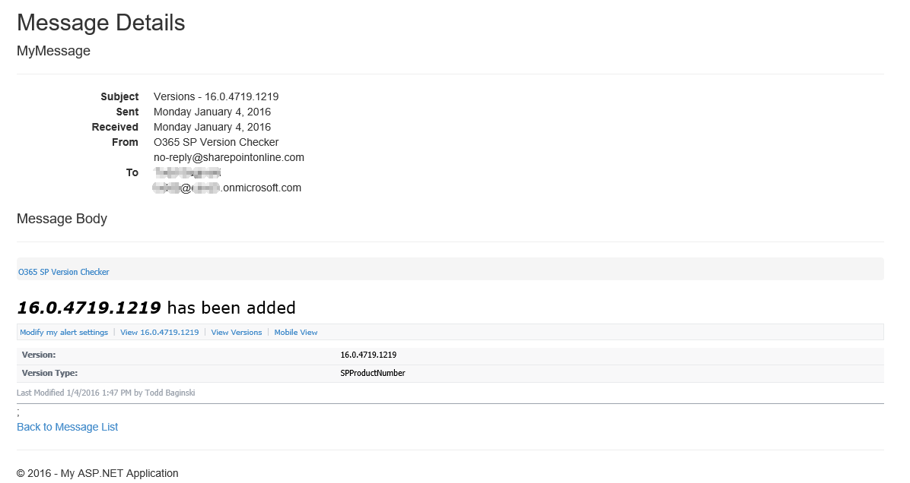
     4. Close the browser window, terminate the debugging session, and return to Visual Studio.

7. Add a route handler delete a message:
  1. In the **MailController.cs** file, add an action method named **Delete** that uses the following code to delete a message.

    ```c#
    public async Task<ActionResult> Delete(string id)
    {
        if (id != null)
        {
            await _repo.DeleteMessage(id);
        }

        return Redirect("/Mail");
    }
    ```

  2. Test **Delete** function:
    1. In **Visual Studio**, press **F5** to begin debugging.

	 > **Note:** If you receive an error that indicates ASP.NET could not connect to the SQL database, please see the [SQL Server Database Connection Error Resolution document](../../SQL-DB-Connection-Error-Resolution.md) to quickly resolve the issue. 

    2. When prompted, log in with your **Organizational Account**.
    3. On the **Messages** list, the message can be deleted by clicking the **Delete** menu option.
    4. Close the browser window, terminate the debugging session, and return to Visual Studio.

8. Add a route handler and views to handle sending messages:
  1. In the **MailController.cs** file, add an action method named **Send** using the following code to create a new event. Notice how you are adding two items, when the create form is requested (the `HttpGet` option) and one for when the form is submitted (the `HttpPost` option).

    ```c#
    [HttpGet]
    public ActionResult Send()
    {
        return View(new MyMessage());
    }

    [HttpPost]
    public async Task<ActionResult> Send(MyMessage myEvent)
    {
        myEvent.FromName = User.Identity.Name;
        myEvent.FromEmailAddress = User.Identity.Name;

        await _repo.SendMessage(myEvent);
        return Redirect("/Mail");
    }
    ```

  2. Update the view to send the message.
    1. Within the `MailController` class, right click the `Send()` at the end of the `Send` method and select **Add View**.
    2. Within the **Add View** dialog, set the following values:
      1. View Name: **Send**.
      2. Template: **Empty (without model)**.
         Leave all other fields blank & unchecked.
      3. Click **Add**.<br/>
      4. Within the **Views/Mail/Send.cshtml** file, delete all the code in the file and replace it with the following code:
      
	     ```html
		@model Office365Mail.Models.MyMessage
		@{
		    ViewBag.Title = "Send";
		}
		<h2>Send Message</h2>
		@using (Html.BeginForm())
		{
		    @Html.AntiForgeryToken()
		
		    <div class="form-horizontal">
		        <div class="form-group">
		            @Html.LabelFor(model => model.ToName, htmlAttributes: new { @class = "control-label col-md-2" })
		            <div class="col-md-10">
		                @Html.EditorFor(model => model.ToName, new { htmlAttributes = new { @class = "form-control" } })
		                @Html.ValidationMessageFor(model => model.ToName, "", new { @class = "text-danger" })
		            </div>
		        </div>
		        <div class="form-group">
		            @Html.LabelFor(model => model.ToEmailAddress, htmlAttributes: new { @class = "control-label col-md-2" })
		            <div class="col-md-10">
		                @Html.EditorFor(model => model.ToEmailAddress, new { htmlAttributes = new { @class = "form-control" } })
		                @Html.ValidationMessageFor(model => model.ToEmailAddress, "", new { @class = "text-danger" })
		            </div>
		        </div>
		        <div class="form-group">
		            @Html.LabelFor(model => model.Subject, htmlAttributes: new { @class = "control-label col-md-2" })
		            <div class="col-md-10">
		                @Html.EditorFor(model => model.Subject, new { htmlAttributes = new { @class = "form-control" } })
		                @Html.ValidationMessageFor(model => model.Subject, "", new { @class = "text-danger" })
		            </div>
		        </div>
		        <div class="form-group">
		            @Html.LabelFor(model => model.Body, htmlAttributes: new { @class = "control-label col-md-2" })
		            <div class="col-md-10">
		                @Html.EditorFor(model => model.Body, new { htmlAttributes = new { @class = "form-control", @style = "width=100%" } })
		                @Html.ValidationMessageFor(model => model.Body, "", new { @class = "text-danger" })
		            </div>
		        </div>
		        <div class="form-group">
		            <div class="col-md-offset-2 col-md-10">
		                <input type="submit" value="Create" class="btn btn-default" />
		            </div>
		        </div>
		    </div>
		}
		<div>
		    @Html.ActionLink("Back to List", "Index")
		</div>
	     ```

      5. Open the **Global.asax** file.
      6. Add the following `using` statements to the top of the **Global.asax** file:  
      
        ```c#
		using System.IdentityModel.Claims;
		using System.Web.Helpers;
        ```
      6. On the **Global.asax** file, add the following code to function **Application_Start**.
         
         ```c#
        // configure antiforgery token to use specific claim in the 
        // case default claim type it uses isn't in the user's claim...
        // specify it to something you know is present in their claim
        AntiForgeryConfig.UniqueClaimTypeIdentifier = ClaimTypes.NameIdentifier;
         ```
  3. Test **Send** view:
     1. In **Visual Studio**, press **F5** to begin debugging.

	  > **Note:** If you receive an error that indicates ASP.NET could not connect to the SQL database, please see the [SQL Server Database Connection Error Resolution document](../../SQL-DB-Connection-Error-Resolution.md) to quickly resolve the issue. 

     2. When prompted, log in with your **Organizational Account**.
     3. In the **Messages** list, create a new message by clicking the **Create New Message** menu option.
        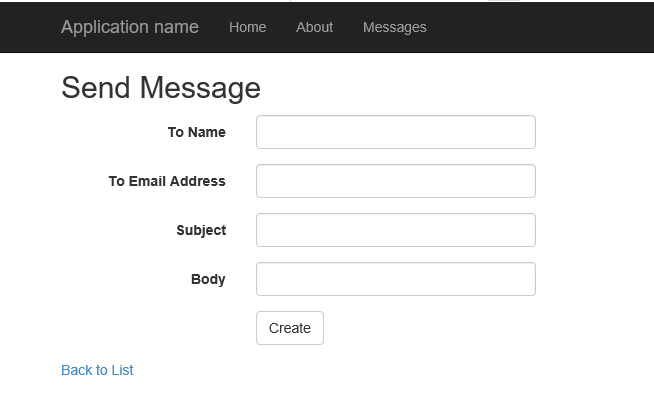
     4. Fill the form out, and click the **Create** button to send the message.
        
11. Close the browser window, terminate the debugging session, and return to Visual Studio.

**Congratulations! You have completed working with the Mail API.**